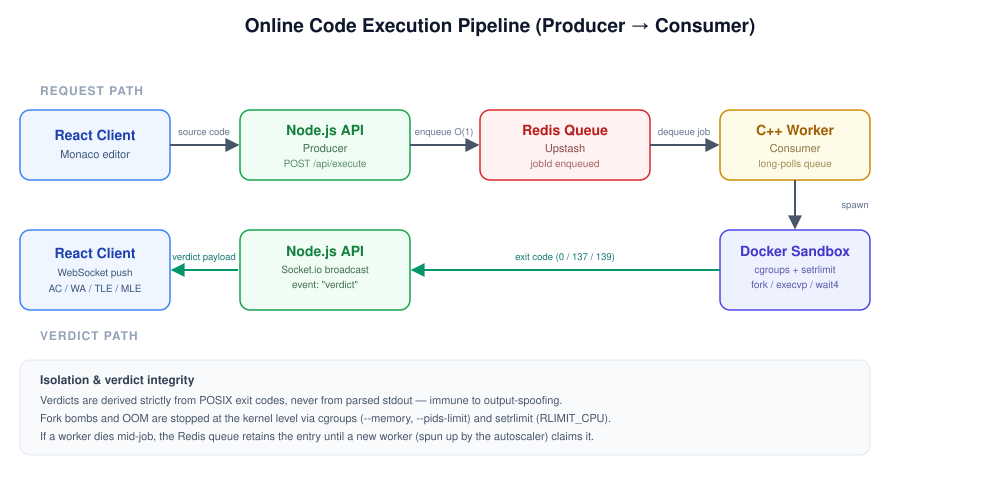
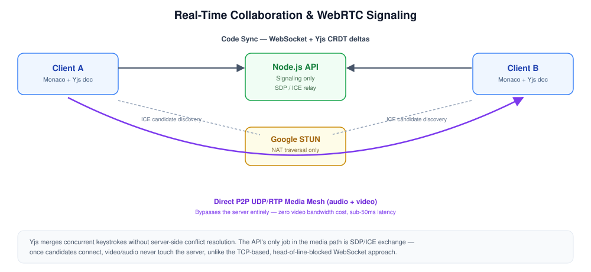

<div align="center">
  
  <h1>CodeSpace</h1>
  <p><strong>A Distributed Real-Time Code Execution Engine & Educational Dashboard</strong></p>
  <br />
  <p>
    <a href="https://github.com/shashank-chowdary/Codespace/blob/main/LICENSE">
      
    </a>
    
    
    
    
    
    
    
    </p>
</div>

---

## Overview

**CodeSpace** is a distributed, horizontally scalable code execution platform designed for technical interviews and algorithmic problem-solving. It securely compiles and evaluates untrusted user-submitted code (C++, Python, Java, JavaScript, C) against hidden test suites in real-time.

By leveraging a decoupled producer-consumer architecture, ephemeral Docker sandboxing, and real-time WebRTC/WebSocket communication layers, CodeSpace is capable of sustaining **thousands of concurrent users** while maintaining sub-second verdict latency.

---

## Table of Contents

- [Core Features](#core-features)
- [System Requirements](#system-requirements)
- [System Interface Definition (API Design)](#system-interface-definition-api-design)
- [System Architecture & Data Flow](#system-architecture--data-flow)
- [Architectural Decisions](#architectural-decisions)
- [Database Schema Design](#database-schema-design)
- [Fault Tolerance & Reliability (Edge Cases)](#fault-tolerance--reliability-edge-cases)
- [System Optimizations & Load Testing](#system-optimizations--load-testing)
- [Capacity Estimations (Back-of-the-Envelope)](#capacity-estimations-back-of-the-envelope)
- [Getting Started](#getting-started)
- [License](#license)

---

## Core Features

- **Automated Problem Ingestion:** Paste any LeetCode problem URL to instantly mirror the problem on CodeSpace. A GraphQL integration queries LeetCode's external API, dynamically parsing titles, descriptions, constraints, and test cases directly into the MongoDB database.
- **Peer-to-Peer Video Conferencing:** Embedded WebRTC video streaming allows seamless, zero-latency communication during technical interviews.
- **Real-Time Workspace Synchronization:** Code editors (Monaco) are synchronized in real-time across clients using WebSockets and Yjs (CRDTs).
- **Hardened Multi-Language Sandboxing:** Source code is strictly evaluated inside ephemeral Docker environments with POSIX-level boundaries enforcing rigid Memory and Time constraints (MLE/TLE).


---

## System Requirements

As a system design document, CodeSpace is engineered to meet the following strict parameters:

### Functional Requirements

- Users can write, compile, and execute code in multiple languages (C++, Python, Java, JavaScript, C).
- The system evaluates the submitted code against hidden test suites and returns standardized verdicts (AC, WA, TLE, MLE, RE).
- Users can collaborate in real-time via synchronized text editors and WebRTC video/audio streaming.
- The system can ingest and parse live LeetCode problems dynamically via URL.

### Non-Functional Requirements

- **Low Latency:** Code execution verdicts must be delivered to the client in under **500ms** to ensure a responsive interview environment.
- **High Availability & Scalability:** The backend must handle sudden traffic bursts (e.g., 4,000+ concurrent users) gracefully through queuing and load shedding.
- **Security & Isolation (Zero Trust):** Untrusted user code must be strictly isolated to prevent host compromises, fork bombs, network access, or memory leaks.

---

## System Interface Definition (API Design)

The system relies on a hybrid REST and WebSocket communication model.

### 1. Code Execution (REST)

Used to enqueue a compilation job.
**`POST /api/execute`**

```json
// Request Payload
{
  "language": "cpp",
  "code": "#include <iostream> \n int main() { return 0; }",
  "problemId": "60d5ecb8b3112a00155b4124"
}
// Response (202 Accepted)
{ "jobId": "uuid-v4", "status": "QUEUED" }
```

### 2. Real-Time Verdicts (WebSocket)

Used by the client to listen for asynchronous execution results.
**`Event: "verdict"`**

```json
// Payload pushed from Server -> Client
{
  "jobId": "uuid-v4",
  "verdict": "AC", // Accepted, WA, TLE, MLE, RE
  "executionTimeMs": 12,
  "memoryUsedKb": 4096
}
```

---

## System Architecture & Data Flow

CodeSpace is built to avoid main-thread blocking by strictly decoupling API ingestion from compute-heavy compilation tasks.

### Online Code Execution Pipeline (Producer-Consumer)



1. **Ingestion:** The React client dispatches the source code payload to the Node.js API (Producer).
2. **Buffering:** The Producer validates the payload and enqueues it to an **Upstash Redis Queue**.
3. **Consumption:** Independent C++ Worker nodes (Consumers) long-poll the queue for available tasks.
4. **Sandboxing:** The Workers orchestrate isolated **Docker containers** to execute the untrusted code. Memory and CPU limits are strictly enforced via Linux cgroups and POSIX system calls.
5. **Real-time Broadcast:** Verdicts (AC, WA, RE, CE, TLE, MLE) are emitted via **Socket.io** back to the Producer, which immediately pushes the update to the React client via persistent WebSocket tunnels.

### Real-Time Collaboration & WebRTC Signaling



- **Code Synchronization:** Utilizes **Yjs (Conflict-free Replicated Data Types)** to merge keystrokes seamlessly over WebSockets without server-side conflict resolution overhead.
- **Media Streaming:** Video and audio bypass the server. The Node.js API acts strictly as a WebRTC signaling mechanism (SDP exchange). The browser then utilizes Google STUN servers to punch through NATs, establishing a zero-latency **Peer-to-Peer UDP Mesh**.

---

## Architectural Decisions

CodeSpace is engineered to mitigate the inherent security and scalability risks of online code execution at scale by treating the execution environment as entirely untrusted.

### 1. Why the MERN Stack?

- **Alternatives:** Java/Spring Boot (Backend), PostgreSQL (Database).
- **The Decision (Node.js):** The asynchronous event-driven architecture manages thousands of persistent WebSocket tunnels without the massive memory overhead of a thread-per-request model.
- **The Decision (MongoDB):** A NoSQL document store perfectly aligns with the highly nested JSON payloads retrieved via the LeetCode GraphQL integration, completely avoiding rigid SQL migrations.

### 2. Why C++ for the Execution Worker Engine?

- **Alternatives:** Node.js `child_process`, Python `subprocess`, or Go.
- **The Decision:** C++ was chosen for three critical reasons:
  1. **Deterministic Performance:** Unlike Go or Node.js, C++ lacks a Garbage Collector (GC). This guarantees near-zero engine overhead, ensuring that when a candidate receives a "Time Limit Exceeded" (TLE), it is strictly due to algorithmic complexity rather than the engine's GC pauses.
  2. **Direct Kernel Access:** C++ provides native, unabstracted access to Linux POSIX system calls (`fork`, `execvp`, `setrlimit`, `wait4`). This enables the engine to enforce hard CPU and Memory limits at the OS level without slow FFI (Foreign Function Interface) bindings.
  3. **Hardware Signal Trapping:** It directly traps raw OS-level hardware signals (e.g., `SIGSEGV` for array out-of-bounds, `SIGFPE` for divide-by-zero) and instantly maps them to accurate LeetCode-style "Runtime Errors" (RE).

### 3. Why Docker Cgroups for Isolation?

- **The Decision:** Relying on application-level timeouts or language-specific sandboxes is fundamentally insecure for remote code execution. Docker's **cgroups** and namespaces enforce strict, un-bypassable kernel-level boundaries on memory limits (`--memory`) and process counts (`--pids-limit`), preventing malicious fork bombs or host-system OOM crashes.

### 4. Why Exit Codes over Standard Output (Stdout)?

- **The Decision:** Parsing `stdout` for test case verification is extremely dangerous. A malicious candidate could simply execute `print("Accepted")` or `print("Correct")` to easily trick the execution engine. By communicating verdicts via strictly controlled POSIX **exit codes** (e.g., `0` for AC, `139` for SIGSEGV, `137` for OOM), the execution pipeline is completely immune to output-spoofing attacks.

### 5. Why WebRTC instead of WebSockets for Video?

- **The Decision:** WebSockets use TCP, where packet loss causes head-of-line blocking (latency spikes). WebRTC utilizes **UDP/RTP**, allowing packet loss without halting the stream, resulting in smooth, sub-50ms latency. The **P2P mesh** eliminates server bandwidth costs entirely.

### 6. Why WebSockets for Execution Verdicts?

- **Alternatives:** HTTP Short Polling.
- **The Decision:** HTTP Polling introduces massive TCP handshake overhead. WebSockets establish a single persistent TCP tunnel, reducing network overhead by ~97% and pushing verdict latency down from 1.5s to **~45ms**.

### 7. Why Socket.io over Raw WebSockets (WS)?

- **The Decision:** While raw WebSockets (`ws`) are lighter, Socket.io provides critical production-grade features out of the box: **Ping/Pong heartbeat logic** to detect dropped candidate connections, automatic network reconnections during partitions, and seamless integration with the **Socket.io Redis Adapter** for broadcasting events across horizontally scaled API nodes.

### 8. Why Redis Queues?

- **The Decision:** Spawning heavy compilation processes directly blocks the Node.js event loop. Upstash Redis acts as a message broker, allowing the API to enqueue a job (an O(1) operation taking <2ms) and immediately return. Independent workers consume the queue at their own pace.

### 9. Why a Custom Worker Autoscaler?

- **Alternatives:** Kubernetes (KEDA).
- **The Decision:** To maintain high availability during traffic spikes without incurring cloud-specific scaling costs, CodeSpace employs a custom autoscaling daemon. By monitoring the Redis queue depth, it dynamically forks localized compute workers to process backlog surges, closely mimicking the behavior of Kubernetes Event-driven Autoscaling (KEDA).

### 10. Why a 3-Tiered Rate Limiting Strategy?

We employ a 3-tiered defense against traffic spikes and malicious actors:

1. **Compute Scaling (Autoscaler):** Dynamically provisions additional worker processes to handle increased queue depth.
2. **Load Shedding (Global Capacity Limit):** If the ingestion queue exceeds a predefined threshold, the API actively sheds load (returning `HTTP 503 Service Unavailable`) to prevent cascading OOM failures.
3. **Redis-Backed IP Rate Limiting:** A strict user-level throttle (10 req/min) prevents individual malicious actors from artificially triggering the global load shed.

### 11. Why End-to-End Integration Testing?

- **The Decision:** Given the heavy reliance on external stateful infrastructure (MongoDB, Redis, Docker) and asynchronous real-time events (WebSockets), standard unit tests are insufficient. Integration tests provide a true representation of the production environment by testing the entire distributed data flow, ensuring no race conditions, dangling sockets, or deadlocks occur across the execution lifecycle.

---

## Database Schema Design

CodeSpace utilizes **MongoDB**, a NoSQL document store, chosen specifically for its flexibility in handling highly nested, unstructured JSON payloads (such as LeetCode test cases and problem descriptions) without rigid SQL schema migrations.

### 1. Users Collection

Optimized for rapid authentication and stateless JWT issuance.

```json
{
  "_id": "ObjectId",
  "username": "String (Unique, Indexed)",
  "email": "String (Unique, Indexed)",
  "password": "String (Bcrypt Hashed)",
  "refreshToken": "String"
}
```

### 2. Problems Collection

Mirrors the LeetCode schema, optimized for heavy read operations and minimal writes.

```json
{
  "_id": "ObjectId",
  "title": "String",
  "titleSlug": "String (Unique, Indexed)",
  "difficulty": "String (Easy / Medium / Hard)",
  "content": "String (HTML)",
  "testCases": [
    {
      "input": "String",
      "output": "String"
    }
  ]
}
```

---

## Fault Tolerance & Reliability (Edge Cases)

A robust System Design must account for failure modes. CodeSpace handles distributed edge cases gracefully:

1. **Worker Node Failure (OOM or Hardware Crash):**
   If a C++ worker dies mid-execution, the Redis Queue (which uses reliable queueing constructs) retains the job. Once a new worker node spins up via the Autoscaler, it will pick up the orphaned job, ensuring zero dropped submissions.
2. **Malicious Infinite Loops / Fork Bombs:**
   Handled entirely at the Linux kernel level. Docker `cgroups` enforce strict `--memory` limits to prevent host OOM. POSIX `setrlimit` enforces `RLIMIT_CPU`, triggering a `SIGKILL` if a candidate writes an infinite `while(true)` loop (Time Limit Exceeded).
3. **Database / Redis Partitions:**
   The Express API actively monitors the Upstash Redis connection. If the connection drops, the API trips a circuit breaker and sheds load (`HTTP 503`), preventing requests from hanging the Node.js event loop indefinitely.
4. **WebSocket Disconnections:**
   Socket.io implements a built-in heartbeat mechanism (ping/pong). If a client drops due to poor network conditions, the session is preserved in memory, and the client auto-reconnects seamlessly without losing their code editor state.

---

## System Optimizations & Load Testing

> [!TIP]
> **Performance Proof:** The architecture has been rigorously load-tested. See the [`/benchmarks`](./benchmarks) directory for the raw `autocannon` load-test scripts and metric outputs.

| Metric Category          | Benchmark / Limit                | Technical Implementation                                                                                       |
| :----------------------- | :------------------------------- | :------------------------------------------------------------------------------------------------------------- |
| **API Scalability**      | **4,000** concurrent connections | Redis-backed ingestion securely buffers pipelined requests at **~165ms** average latency.                      |
| **Verdict Latency**      | **~45 ms** delivery time         | **~97% reduction** in latency achieved by migrating from HTTP Polling to a WebSocket Pub/Sub model.            |
| **Compute Throughput**   | **15x** execution speedup        | C++ `compile-once, run-many` batching cut 10-testcase execution time from 4.65s to **~300ms**.                 |
| **Memory Optimization**  | **~40 MB** heap reduction        | Zero-copy Redis payload serialization eliminated GC spikes and significantly unblocked the Node.js event loop. |
| **Database Overhead**    | **50%** fewer read queries       | In-memory document reuse completely eliminated N+1 query bottlenecks during Authentication.                    |
| **System Reliability**   | **100%** E2E pass rate           | 87 integration tests guarantee fault-tolerance against event-loop hangs, race conditions, and socket leaks.    |
| **Infrastructure Costs** | **Zero external cost**           | Custom WebRTC Peer-to-Peer mesh over Google STUN eliminated all external video streaming APIs.                 |

## Capacity Estimations (Back-of-the-Envelope)

Because interview traffic is highly bursty (clustered around business hours), we model our capacity based on concurrent sessions rather than generic DAU.

Assuming a scale of **10,000 Daily Technical Interviews** (averaging 45 mins each) with peak bursts of **2,000 concurrent active sessions**:

| Metric                       | Calculation / Context                                                      | Estimated Value                                  |
| :--------------------------- | :------------------------------------------------------------------------- | :----------------------------------------------- |
| **WebSocket (Code Sync)**    | 4,000 connected peers (2 per interview) sending Yjs CRDT keystroke deltas. | **~4,000 QPS** (Bidirectional Socket.io traffic) |
| **Traffic (Code Execution)** | 2,000 candidates clicking 'Run Code' ~10 times per session.                | **~7.5 QPS** (Sustained) / **~50 QPS** (Burst)   |
| **Compute Node Scaling**     | 50 QPS (Burst) * 0.3s avg Docker execution time.                           | **~15 Worker Nodes** required during peak bursts |
| **Redis Queue Buffer**       | 50 QPS spike * 5KB payload size.                                           | **< 1 MB** active memory buffer required         |
| **Storage (Database)**       | 10,000 sessions * 5 final code snapshots * 5KB.                            | **~250 MB / day** (~90 GB / year)                |
| **Network (Video/Audio)**    | 2,000 concurrent WebRTC peer-to-peer mesh connections.                     | **0 TB / month** (Server bandwidth bypassed)     |

---

## Getting Started

### 1. Prerequisites

- [Node.js](https://nodejs.org/) (v18 or higher)
- [Docker Engine](https://docs.docker.com/engine/install/) (Running in the background)
- [MongoDB Atlas](https://www.mongodb.com/cloud/atlas) or local MongoDB instance
- [Upstash Redis](https://upstash.com/) or local Redis instance

### 2. Infrastructure Setup

```bash
git clone https://github.com/shashank-chowdary/Codespace.git
cd Codespace

# Pull the required execution environment container for C++
docker pull gcc:latest
```

### 3. Backend & Worker Initialization

```bash
cd backend
npm install
```

Create a `.env` file in the `backend/` directory and populate it with your credentials:

| Variable               | Description                                  |
| :--------------------- | :------------------------------------------- |
| `PORT`                 | API Port (default: 8000)                     |
| `MONGO_URI`            | Your MongoDB connection string               |
| `REDIS_URL`            | Your Upstash or local Redis URL              |
| `CORS_ORIGIN`          | Frontend URL (e.g., `http://localhost:5173`) |
| `JWT_SECRET`           | Secret key for general JWT operations        |
| `ACCESS_TOKEN_SECRET`  | Secret key for short-lived access tokens     |
| `REFRESH_TOKEN_SECRET` | Secret key for long-lived refresh tokens     |

Start the API and the Execution Worker (in separate terminals):

```bash
# Terminal 1: Start the Express API
npm run dev

# Terminal 2: Start the Queue Worker
npm run worker
```

### 4. Frontend Initialization

```bash
cd ../frontend
npm install
npm run dev
```

Navigate to `http://localhost:5173` to see the application running.

## License

This project is licensed under the **MIT License** - see the [LICENSE](LICENSE) file for details.

---

## Author

**K. Shashank Chowdary**

- GitHub: [@shashank-chowdary](https://github.com/shashank-chowdary)
- LinkedIn: [Shashank Chowdary](https://linkedin.com/in/shashank-chowdary)

> If you like this project, please consider giving it a ⭐ on GitHub!
